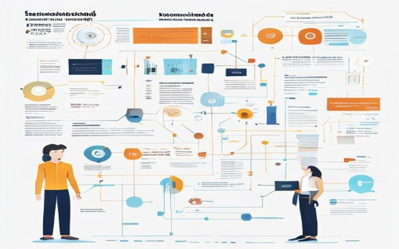

# Supervised vs Unsupervised Learning Explained with Examples

## Introduction to Machine Learning
Machine learning is a subset of artificial intelligence that involves the use of algorithms and statistical models to enable machines to perform a specific task without being explicitly programmed. In essence, machine learning allows systems to learn from data, identify patterns, and make decisions with minimal human intervention. 
### Types of Machine Learning
There are several types of machine learning, including supervised, unsupervised, and reinforcement learning. Supervised learning involves training a model on labeled data, while unsupervised learning involves training a model on unlabeled data. 
### Importance of Machine Learning
The importance of machine learning cannot be overstated, as it has numerous applications in image recognition, natural language processing, and predictive analytics. Machine learning has the potential to revolutionize various industries, including healthcare, finance, and transportation, by enabling systems to make data-driven decisions and improve overall efficiency.

*Figure 1: Introduction to Machine Learning*

## Supervised Learning Explained
Supervised learning is a type of machine learning where the algorithm is trained on labeled data, meaning the data is already tagged with the correct output. This allows the algorithm to learn from the data and make predictions on new, unseen data.

### The Process of Supervised Learning
The process of supervised learning involves several steps. First, a dataset is gathered and labeled with the correct output. The algorithm is then trained on this data, learning to map the input to the output. The goal is to find a pattern or relationship between the input and output, so the algorithm can make accurate predictions on new data.

### Examples of Supervised Learning
Supervised learning has many real-world applications. For example, image classification, where an algorithm is trained to recognize objects in images, such as dogs or cars. Another example is sentiment analysis, where an algorithm is trained to classify text as positive or negative. Additionally, supervised learning can be used in speech recognition, where an algorithm is trained to recognize spoken words and transcribe them into text. These examples demonstrate the power and versatility of supervised learning in a wide range of applications.

> **📊 Diagram illustrating Supervised Learning Explained**  
> _Figure 2: Supervised Learning Explained_  
> ⚠️ Image generation failed: HTTPSConnectionPool(host='image.pollinations.ai', port=443): Read timed out. (read timeout=60)

## Unsupervised Learning Explained
Unsupervised learning is a type of machine learning where the algorithm is not provided with labeled data, and it must find patterns or relationships in the data on its own. 

### Definition and Process
The definition of unsupervised learning emphasizes the absence of labeled data, allowing the model to discover hidden structures or groupings within the data. The process of unsupervised learning involves the algorithm analyzing the data to identify patterns, such as clustering similar data points or dimensionality reduction.

### Examples and Applications
Examples of unsupervised learning include customer segmentation, where a company groups customers based on their buying behavior, and image compression, where an algorithm reduces the number of pixels in an image while preserving its key features. Other applications of unsupervised learning include anomaly detection, recommender systems, and gene expression analysis. These examples demonstrate how unsupervised learning can be used to extract insights from complex data sets without prior knowledge of the expected output.

## Comparison of Supervised and Unsupervised Learning
When it comes to machine learning, two fundamental approaches stand out: supervised and unsupervised learning. Understanding the differences and similarities between these two methods is crucial for developers to make informed decisions about which approach to use.

### Differences
The primary difference between supervised and unsupervised learning lies in the presence or absence of labeled data. Supervised learning involves training a model on labeled data, where the correct output is already known. In contrast, unsupervised learning deals with unlabeled data, and the model must find patterns or relationships on its own.

### Similarities
Despite their differences, supervised and unsupervised learning share some commonalities. Both approaches aim to identify patterns in data and make predictions or decisions based on that data. Additionally, both methods can be used for data preprocessing, feature extraction, and model evaluation.

### Choosing Between Supervised and Unsupervised Learning
When choosing between supervised and unsupervised learning, consider the nature of the problem and the availability of labeled data. If labeled data is abundant and the goal is to make predictions based on that data, supervised learning is often the better choice. However, if labeled data is scarce or nonexistent, unsupervised learning can be used to discover hidden patterns and relationships in the data. Ultimately, the choice between supervised and unsupervised learning depends on the specific requirements of the project and the characteristics of the data.

## Real-World Applications of Supervised and Unsupervised Learning
Supervised and unsupervised learning are two fundamental concepts in machine learning, and they have numerous real-world applications. 
### Applications of Supervised Learning
Supervised learning is used in applications where the machine learning model is trained on labeled data. Examples include image classification, speech recognition, and sentiment analysis. For instance, supervised learning can be used to classify images of objects, recognize spoken words, or determine the sentiment of a piece of text.

### Applications of Unsupervised Learning
Unsupervised learning, on the other hand, is used in applications where the machine learning model is trained on unlabeled data. Examples include customer segmentation, anomaly detection, and recommender systems. Unsupervised learning can help identify patterns or relationships in data that may not be immediately apparent.

### Future of Supervised and Unsupervised Learning
As machine learning continues to evolve, we can expect to see even more innovative applications of supervised and unsupervised learning. With the increasing availability of large datasets and advances in computing power, the potential for supervised and unsupervised learning to drive business value and improve our daily lives is vast. Developers can expect to see new opportunities for applying these techniques to complex problems, leading to breakthroughs in fields such as healthcare, finance, and transportation.
